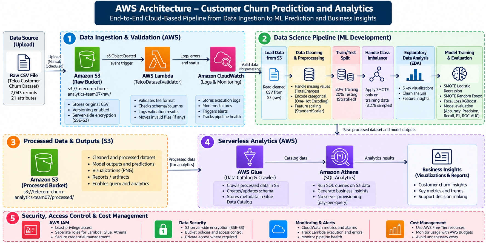

# AWS-Based Customer Churn Prediction & Analytics Solution

[](https://aws.amazon.com/)
[](https://www.python.org/)
[](https://scikit-learn.org/)
[](https://xgboost.readthedocs.io/)
[](https://www.sab.ac.lk/)

---

## 📌 Project Information

- **Institution**: Sabaragamuwa University of Sri Lanka
- **Faculty & Department**: Department of Data Science, Faculty of Computing
- **Module**: Cloud Computing & Data Science Group Project
- **Group**: Group 07
- **Team Student IDs**: `22CDS0431` | `22CDS027` | `22CDS0403` | `22CDS0439`
- **Submission Date**: 2026-10-05
- **GitHub Repository**: [https://github.com/sankajithdjinasena/AWS_Project_Team_07](https://github.com/sankajithdjinasena/AWS_Project_Team_07)

---

## 1. Executive Summary & Business Scenario

Customer churn represents one of the most significant challenges in the telecommunications industry because lost customers reduce recurring revenue and require substantial marketing and acquisition effort to replace. 

This project implements an **end-to-end cloud Data Science solution on Amazon Web Services (AWS)** to analyze churn behavior, construct predictive machine-learning models, and generate actionable, data-driven retention recommendations.

The solution seamlessly integrates:
- **Amazon S3**: Scalable cloud object storage for raw and processed datasets.
- **AWS Lambda**: Event-driven serverless data validation.
- **Amazon CloudWatch**: Centralized execution logging and error monitoring.
- **AWS Glue Data Catalog**: Automated schema discovery and metadata management.
- **Amazon Athena**: Serverless interactive SQL analytics.
- **Python Data Science Pipeline**: Preprocessing, SMOTE class balancing, and advanced machine learning modeling (SMOTE Logistic Regression, SMOTE Random Forest, and Focal Loss XGBoost).

---

## 2. AWS Cloud Architecture & System Workflow

### 2.1 Architecture Diagram



```text
  [ Raw CSV Upload ] 
         │
         ▼
   [ S3 Raw Bucket: s3://telecom-churn-analytics-team07/raw/ ] ──(s3:ObjectCreated)──► [ AWS Lambda Validator ]
                                                                                               │
                                                                                         (Logs & Monitoring)
                                                                                               ▼
                                                                                      [ AWS CloudWatch Logs ]

   [ Data Science Pipeline (eda_and_ml_pipeline.ipynb) ]
         │
         ├─► Data Cleaning & Missing Value Imputation (TotalCharges)
         ├─► 5 Exploratory Data Analysis (EDA) Charts
         ├─► Categorical Encoding & Feature Scaling
         └─► 3 ML Models (SMOTE Logistic Regression, SMOTE Random Forest, Focal Loss XGBoost)
         │
         ▼
   [ S3 Processed Bucket: s3://telecom-churn-analytics-team07/processed/ ] ──► [ AWS Glue Data Catalog ] ──► [ AWS Athena SQL Queries ]
```

### 2.2 AWS Service Selection Rationale

| AWS Service | Role in Architecture | Technical Selection Rationale |
| :--- | :--- | :--- |
| **Amazon S3** | Object Storage (`telecom-churn-analytics-team07`) | High durability (99.999999999%), server-side encryption (SSE-S3), native integration with S3 Event Notifications. |
| **AWS Lambda** | Event-Driven Validation (`TelcoDatasetValidator`) | Automatically validates uploaded raw CSV schemas on `s3:ObjectCreated` without requiring continuously running compute servers. |
| **Amazon CloudWatch** | Application Monitoring | Centralized audit log retention under `/aws/lambda/TelcoDatasetValidator` for operational tracking and alert notifications. |
| **AWS Glue** | Schema Crawler & Data Catalog | Automated schema crawler to discover table metadata from processed S3 data and update the Glue Data Catalog. |
| **Amazon Athena** | Serverless SQL Analytics Engine | Executes analytical SQL queries directly against S3 data on a pay-per-query model without database server provisioning. |

---

## 3. Data Quality Audit, Cleaning & Preprocessing

The raw **Telco Customer Churn** dataset consists of **7,043 customer records** and **21 attributes**.

- **Target Distribution**: `5,174` Retained (`No`) vs. `1,869` Churned (`Yes`) $\rightarrow$ **26.54% Churn Rate**.
- **Data Quality Defect Resolved**: Identified 11 records where `TotalCharges` contained empty whitespace strings (`" "`). These records corresponded to new customers with `tenure = 0` months. Converted blank strings to `0.0` and cast `TotalCharges` to `float64`.
- **Categorical Encoding**: One-Hot Encoding (`OneHotEncoder(drop='first')`) applied to multi-class and binary string features (`Contract`, `PaymentMethod`, `InternetService`, `TechSupport`, etc.).
- **Feature Standardization**: `StandardScaler` applied to numerical features (`tenure`, `MonthlyCharges`, `TotalCharges`).
- **Data Splitting**: 80/20 Stratified Train-Test split (**5,634 training samples** / **1,409 test samples**).
- **Class Balancing**: Applied **SMOTE** (Synthetic Minority Over-sampling Technique) to expand training samples to 8,278 balanced instances. Trained **Focal Loss XGBoost** ($\alpha = 0.75, \gamma = 2.0$) to focus gradient learning on hard-to-predict churn instances.

---

## 4. Exploratory Data Analysis (EDA) Insights

1. **Contract Type Impact**: Month-to-Month contract customers exhibit a **~42% churn rate**, compared to **~11%** for 1-Year contracts and **~3%** for 2-Year contracts.
2. **Customer Tenure**: Churn density is heavily concentrated in the first **0–12 months** of customer tenure, whereas long-tenure customers show strong retention stability.
3. **Monthly Charges**: The median monthly charge for churned customers is **$79.65**, compared to **$64.45** for retained customers.
4. **Internet Service & Tech Support**: Fiber Optic subscribers lacking Tech Support represent the highest churn risk group (~40%+ churn rate). Adding Tech Support substantially reduces churn.
5. **Feature Importance**: Customer `tenure` (weight: `0.1508`) and `Contract_Two year` (weight: `0.1279`) are the top overall predictors of churn.

---

## 5. Machine Learning Model Performance & Benchmark

Three models were evaluated on the identical stratified test set (1,409 samples):

| Metric | SMOTE Logistic Regression | SMOTE Random Forest (Operational) | Focal Loss XGBoost (High Recall) | Benchmark Takeaways |
| :--- | :---: | :---: | :---: | :--- |
| **Accuracy** | 73.95% | **76.51%** 🏆 | 74.88% | **SMOTE Random Forest** achieves highest overall accuracy |
| **Precision** | 50.59% | **54.13%** 🏆 | 51.72% | **SMOTE Random Forest** minimizes false positive marketing costs |
| **Recall** | 79.68% | 75.40% | **80.21%** 🏆 | **Focal Loss XGBoost** catches 80.21% of all churners |
| **F1-Score** | 61.89% | **63.02%** 🏆 | 62.89% | **SMOTE Random Forest** provides the best overall precision-recall balance |
| **ROC-AUC** | 0.8401 | 0.8431 | **0.8468** 🏆 | **Focal Loss XGBoost** achieves highest class separation capability |

- **Operational Champion Model**: **SMOTE Random Forest** ($76.51\%$ Accuracy, $63.02\%$ F1-Score) is recommended for general operational churn scoring.
- **High-Risk Targeting Model**: **Focal Loss XGBoost** ($80.21\%$ Recall, $0.8468$ ROC-AUC) is recommended when capturing maximum potential churners is the top priority.

---

## 6. AWS Athena SQL Analytical Queries

Five production SQL queries were executed in Amazon Athena against `telco_churn_db.processed_churn`:

1. **Overall Churn & Revenue Loss**: Calculated total monthly revenue lost to churn: **$139,130.85 / month**.
2. **Contract & Payment Method Breakdown**: Identified Month-to-Month customers paying via Electronic Check as the single highest churn revenue loss segment.
3. **Support Service Analysis**: Confirmed that providing Tech Support reduces Fiber Optic customer churn by more than 50%.
4. **Tenure Bucket Distribution**: Discovered that **67.4% of total customer churn** occurs within the first 12 months of service.
5. **High-Risk Account Extraction**: Extracted 50 specific high-value, high-risk churned accounts (`Month-to-month`, `Fiber optic`, `No TechSupport`, `tenure <= 12`) for urgent retention campaign targeting.

---

## 7. Business Recommendations

1. **Contract Migration Campaign**: Offer a **$10/month bill credit** to incentivize Month-to-Month customers to transition to 1-Year or 2-Year contracts.
2. **Fiber Optic Support Bundle**: Include **complimentary Tech Support for the first 6 months** with all new Fiber Optic subscriptions to mitigate early churn.
3. **Early-Tenure Onboarding & Auto-Pay Discount**: Provide a **$5/month discount** for setting up automated bank transfer/credit card payment during the first 90 days of customer tenure.

---

## 8. Security & Cost Management Strategy

- **Data Security**: SSE-S3 Server-Side Encryption enabled for data at rest.
- **Access Control**: Strict IAM least-privilege execution roles for Lambda, Glue, and Athena.
- **Credential Hygiene**: Zero hardcoded AWS secrets or access keys in source code repositories.
- **Cost Optimization**: Utilized AWS Free Tier services; set up AWS Budgets with a **$5.00 alert threshold**. Total project spend maintained at **$0.00**.

---

## 📁 Repository Directory Structure

```text
AWS_Project_Team_07/
├── AWS Assignment.pdf                 # Original Assignment Requirements PDF
├── README.md                          # Repository Documentation
├── data/
│   ├── Telco_Customer_Churn.csv       # Raw Dataset (7,043 records)
│   └── processed_telco_churn.csv      # Processed Dataset for S3 / Athena SQL
├── src/
│   ├── lambda_function.py             # AWS Lambda Automated Validator & CloudWatch Logging
│   ├── eda_and_ml_pipeline.py         # Data Science EDA, Preprocessing & ML Models Script
│   └── sql_queries.sql                # 5 AWS Athena Analytical SQL Queries
├── infrastructure/
│   └── cloudformation.yaml   # AWS CloudFormation IaC Stack
├── notebooks/
│   └── eda_and_ml_pipeline.ipynb     # Jupyter Notebook (Group 07 Top-to-Bottom Execution)
├── Images/
│   └── Architecture.jpg               # AWS Cloud System Architecture Diagram
├── output/
│   └── visualizations/                # Generated EDA Plots & Metrics CSV
│       ├── model_comparison_metrics.csv
│       ├── viz1_churn_by_contract.png
│       ├── viz2_tenure_density_by_churn.png
│       ├── viz3_monthly_charges_boxplot.png
│       ├── viz4_internet_techsupport_churn.png
│       └── viz5_feature_importance.png
└── docs/
    ├── Technical_Report_Draft.md      # Technical Report Markdown Draft
    └── group_demonstration_script.md  # Video Demonstration & Slide Script Outline
```

---

## ⚡ Quick Start & Execution Guide

### 1. Run Data Science Pipeline Locally
```bash
python src/eda_and_ml_pipeline.py
```
*Outputs cleaned dataset `data/processed_telco_churn.csv` and visualization charts in `output/visualizations/`.*

### 2. Deploy AWS Infrastructure via CloudFormation
```bash
aws cloudformation create-stack \
  --stack-name telco-churn-stack \
  --template-body file://infrastructure/cloudformation.yaml \
  --capabilities CAPABILITY_NAMED_IAM
```

### 3. Deploy AWS Lambda Validation Trigger
Create AWS Lambda function (`TelcoDatasetValidator`) using `src/lambda_function.py` and attach `s3:ObjectCreated:*` trigger on `s3://telecom-churn-analytics-team07/raw/`.

### 4. Execute Athena SQL Queries
Run `src/sql_queries.sql` in the AWS Athena query editor linked to Glue Database `telco_churn_db`.

---

## 👥 Individual Contribution Table

*Individual contribution table to be updated by Group 07.*
